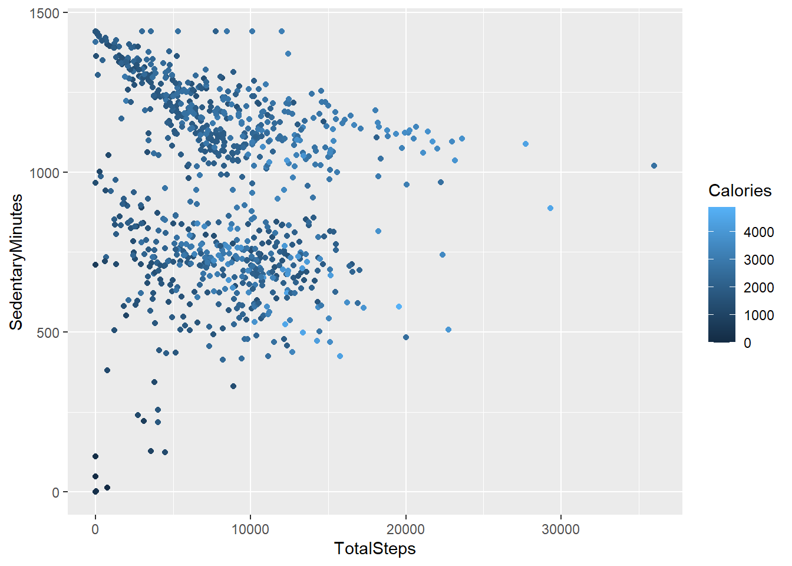
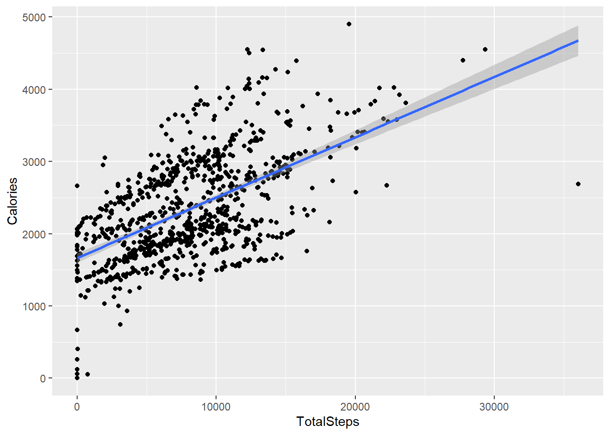
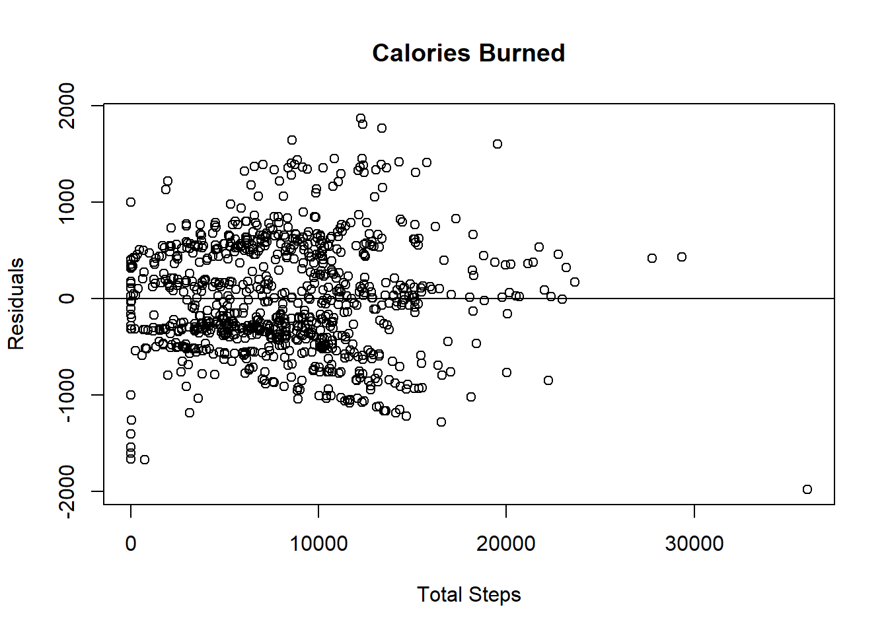
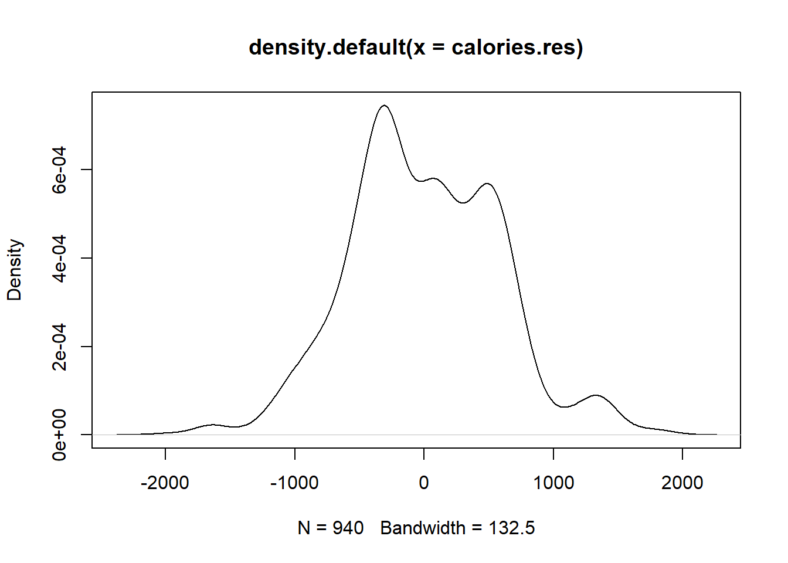
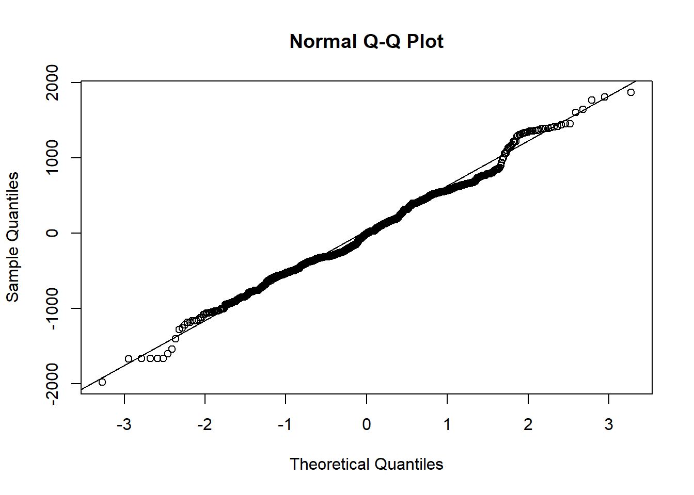
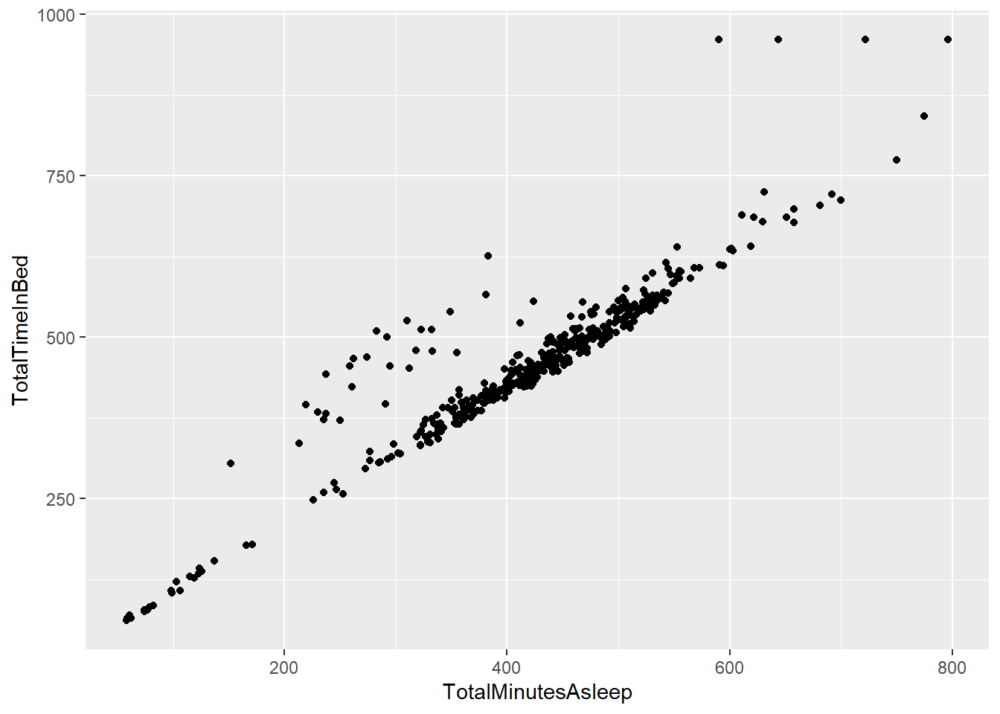
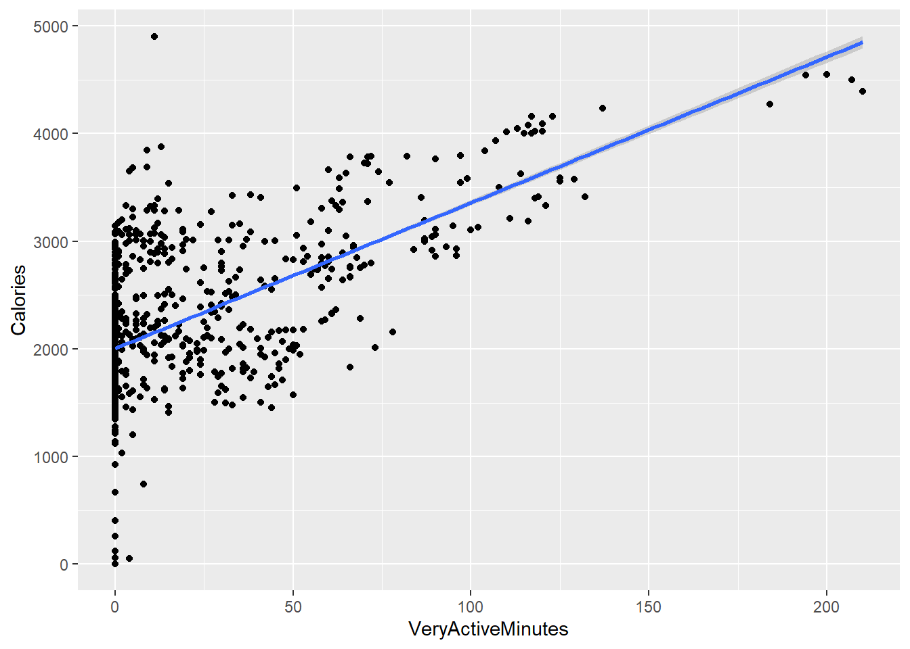
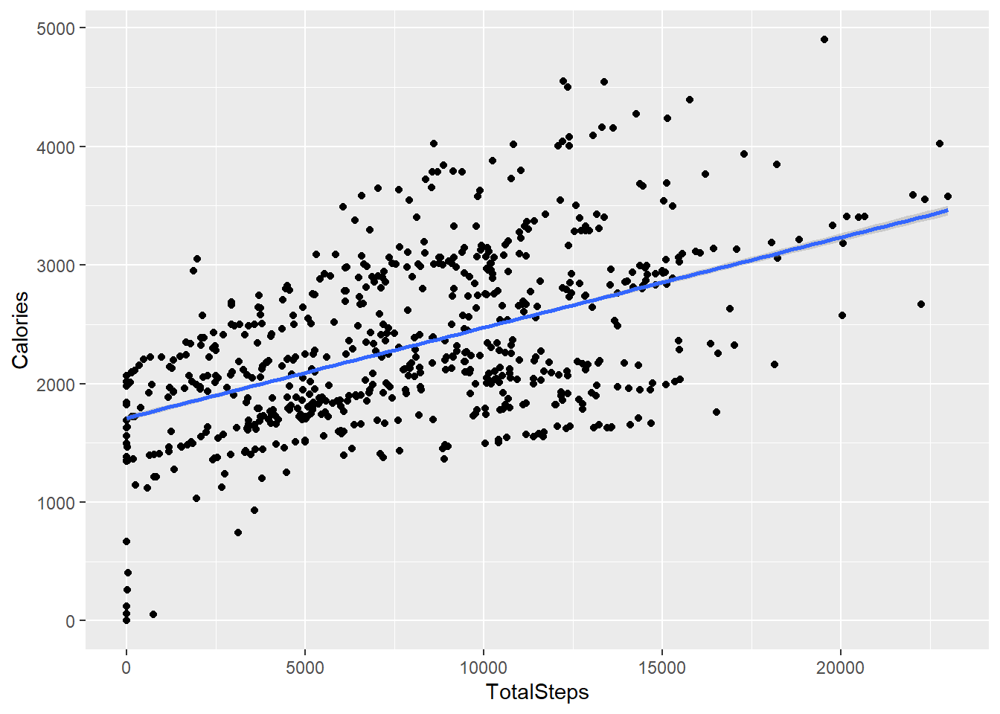
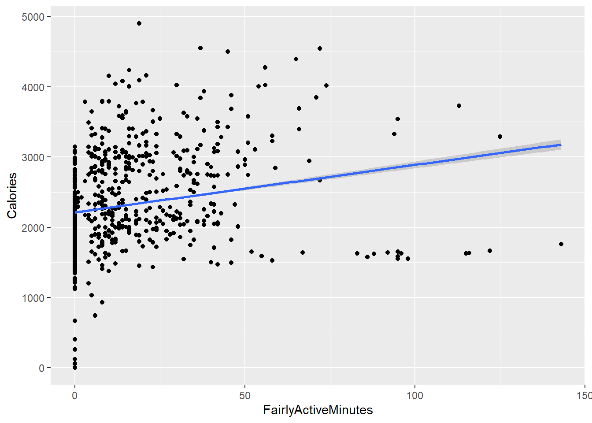

# Case-Study Data Analysis 

## Scenario

You are a junior data analyst working on the marketing analyst team at Bellabeat, a high-tech manufactures of health-focused products for women. Bellabeat is a sucessful small company, but they have the potenial to become a lager player in the global smart device market. Urška Sršen, cofounder and Chief Creative Officer of Bellabeat, believes that analyzing smart device fitness data could help unlock new growth opportunities for the company. You have been asked to focus on one of Bellabeat’s products and analyze smart device data to gain insight into how consumers are using their smart devices. Sršen asks you to analyze smart device usage data in order to gain insight into how consumers use non-Bellabeat smart devices. She then wants you to select one Bellabeat product to apply these insights to in your presentation. The insights you discover will then help guide marketing strategy for the company. You will present your analysis to the Bellabeat executive team along with your high-level recommendations for Bellabeat’s marketing strategy.

## Ask Phase

In this stage of the data analysis process, I identify key stakeholders and ask questions to guide the analysis process.

>### The Stakeholders

> 1. **Urška Sršen:** Bellabeat’s cofounder and Chief Creative Officer.
> 2. **Sando Mur:** Mathematician and Bellabeat’s cofounder; key member of the Bellabeat executive team.
> 3. **Bellabeat marketing analytics team:** A team of data analysts responsible for collecting, analyzing, and reporting data that helps guide Bellabeat’s marketing strategy.

>### Bellabeat Products

> 1. **Bellabeat app:** The Bellabeat app provides users with health data related to their activity, sleep, stress, menstrual cycle, and mindfulness habits. This data can help users better understand their current habits and make healthy decisions. The Bellabeat app connects to their line of smart wellness products.
> 2. **Leaf:** Bellabeat’s classic wellness tracker can be worn as a bracelet, necklace, or clip. The Leaf tracker connects to the Bellabeat app to track activity, sleep, and stress.
> 3. **Time:** This wellness watch combines the timeless look of a classic timepiece with smart technology to track user activity, sleep, and stress. The Time watch connects to the Bellabeat app to provide you with insights into your daily wellness.
> 4. **Spring:** This is a water bottle that tracks daily water intake using smart technology to ensure that you are appropriately hydrated throughout the day. The Spring bottle connects to the Bellabeat app to track your hydration levels.
> 5. **Bellabeat membership:** Bellabeat also offers a subscription-based membership program for users. Membership gives users 24/7 access to fully personalized guidance on nutrition, activity, sleep, health and beauty, and mindfulness based on their lifestyle and goals.

> ### Business Task

> The goal of this case study is to analyze smart device usage data to gain insight into how consumers use non-Bellabeat devices. The insights gained will be used to inform Bellabeat's marketing strategy.

## Prepare Phase

The goal of this case study is to analyze smart device usage data to gain insight into how consumers use non-Bellabeat devices. The insights gained will be used to inform Bellabeat's marketing strategy.

The data is made of up several datasets organized in either long or wide format. However, there are 2 key problems with the data. First, the data is not **recent** as it was collected in 2016. Second, the sample size is too small. Only data for **30** Fitbit users is available yet there are over **30 million** Fitbit users worldwide.

Given these limitations, additional data is required and insights gained from analyzing available data shall not be taken as conclusive.

## Load the packages

I will be using tidyverse package as well as the skimr, here, and janitor packages for help with this project.

We’re also using the sqldf package, which will allow us to emulate SQL syntax when looking at data

## install.packages("sqldf",repos = "http://cran.us.r-project.org")

package 'sqldf' successfully unpacked and MD5 sums checked

## library(sqldf)
Loading required package: gsubfn
Loading required package: proto
Loading required package: RSQLite

## library(tidyverse)
-- Attaching packages --------------------------------------- tidyverse 1.3.1 --
v ggplot2 3.3.5     v purrr   0.3.4
v tibble  3.1.6     v dplyr   1.0.7
v tidyr   1.1.4     v stringr 1.4.0
v readr   2.1.1     v forcats 0.5.1

-- Conflicts ------------------------------------------ tidyverse_conflicts() --
x dplyr::filter() masks stats::filter()
x dplyr::lag()    masks stats::lag()

## library(skimr)
## library(janitor)

Attaching package: 'janitor'
The following objects are masked from 'package:stats':
chisq.test, fisher.test

## Upload the dataset

he data that is provided is FitBit Fitness Tracker Data. This dataset has 18 different csv files that range from Daily activity, calories, steps; hourly calories, intensities, and steps; and heart rate, sleep data and weight logs.

## Load the CSV files

The data frames I’ll be working with in this case study will be creating objects for:

> 1. dailyActivity_merged.csv
> 2. dailyCalories_merged.csv
> 3. sleepDay_merged.csv
> 4. weightLogInfo_merged.csv
> 5. dailyItensities_merged.csv

## Explore the Tables
### dailyActivity

head(dailyActivity_merged)

|   Id       |  ActivityDate |  TotalSteps  |  TotalDistance | TrackerDistance |
| :---       | :---          | :---         | :---           | :---            |
| 1503960366 |  4/12/2016    |  13162       |   8.50         |   8.50          | 
| 1503960366 |  4/13/2016    |  10735       |   6.97         |   6.97          |
| 1503960366 |  4/14/2016    |  10460       |   6.74         |   6.74          |
| 1503960366 |  4/15/2016    |   9762       |   6.28         |   6.28          |
| 1503960366 |  4/16/2016    |  12669       |   8.16         |   8.16          |
| 1503960366 |  4/17/2016    |   9705       |   6.48         |   6.48          |

| LoggedActivitiesDistance | VeryActiveDistance | ModeratelyActiveDistance |
| :--                      | :---               | :---                     |
| 0                        | 1.88               | 0.55                     |
| 0                        | 1.57               | 0.69                     |
| 0                        | 2.44               | 0.40                     |
| 0                        | 2.14               | 1.26                     |
| 0                        | 2.71               | 0.41                     |
| 0                        | 3.19               | 0.78                     |

| LightActiveDistance | SedentaryActiveDistance | VeryActiveMinutes |
| :---                | :---                    | :---              |
| 6.06                | 0                       | 25                |
| 4.71                | 0                       | 21                |
| 3.91                | 0                       | 30                |
| 2.83                | 0                       | 29                |
| 5.04                | 0                       | 36                |
| 2.51                | 0                       | 38                |

| FairlyActiveMinutes | LightlyActiveMinutes | SedentaryMinutes | Calories |
| :---                | :---                 | :---             | :---     |
| 13                  | 328                  | 728              | 1985     |
| 19                  | 217                  | 776              | 1797     |
| 11                  | 181                  | 1218             | 1776     |
| 34                  | 209                  | 726              | 1745     |
| 10                  | 221                  | 773              | 1863     |
| 20                  | 164                  | 539              | 1728     |

colnames(daily_activity)

| [1] "Id"                       | "ActivityDate"              |
| :---                           | :---                        |
| [3] "TotalSteps"               | "TotalDistance"             |           
| [5] "TrackerDistance"          | "LoggedActivitiesDistance"  |
| [7] "VeryActiveDistance"       | "ModeratelyActiveDistance"  |
| [9] "LightActiveDistance"      | "SedentaryActiveDistance"   | 
| [11] "VeryActiveMinutes"       | "FairlyActiveMinutes"       |     
| [13] "LightlyActiveMinutes"    | "SedentaryMinutes"          | 
| [15] "Calories"

glimpse(daily_activity)

Rows: 940
Columns: 15

$ Id                       <dbl>  1503960366  1503960366  1503960366 | 150396036~ 
                    
$ ActivityDate              <chr>  "4/12/2016"  "4/13/2016"  "4/14/2016"  "4/15/~ 
  
$ TotalSteps                <int>  13162, 10735  10460, 9762  12669  9705, 13019~ 
  
$ TotalDistance             <dbl>  8.50, 6.97  6.74, 6.2  8.16, 6.48 | 8.59 | 9.8~ 
  
$ TrackerDistance           <dbl>  8.50, 6.97 | 6.74, 6.28 | 8.16, 6.48 | 8.59, 9.8~ 
  
$ LoggedActivitiesDistance  <dbl>  0, 0, 0, 0 | 0, 0, 0, 0 | 0, 0, 0 | 0, 0, 0, 0, ~ 
  
$ VeryActiveDistance        <dbl>  1.88, 1.57, |2.44, 2.14, |2.71, 3.19, 3.25, 3.5~
  
$ ModeratelyActiveDistance  <dbl>  0.55, 0.69, 0.40, 1.26, 0.41, 0.78, 0.64, 1.3~
  
$ LightActiveDistance       <dbl>  6.06, 4.71, 3.91, 2.83, 5.04, 2.51, 4.71, 5.0~
  
$ SedentaryActiveDistance   <dbl>  0, 0, 0, 0, 0, 0, 0, 0, 0, 0, 0, 0, 0, 0, 0, ~
  
$ VeryActiveMinutes         <int>  25, 21, 30, 29, 36, 38, 42, 50, 28, 19, 66, 4~
  
$ FairlyActiveMinutes       <int>  13, 19, 11, 34, 10, 20, 16, 31, 12, 8, 27, 21~
  
$ LightlyActiveMinutes      <int>  328, 217, 181, 209, 221, 164, 233, 264, 205, ~
  
$ SedentaryMinutes         <int>  728, 776, 1218, 726, 773, 539, 1149, 775, 818~
  
$ Calories                 <int>  1985, 1797, 1776, 1745, 1863, 1728, 1921, 203~
  
weight_log

## head(weight_log)
    Id           Date WeightKg WeightPounds Fat   BMI
1503960366  5/2/2016 11:59:59 PM     52.6     115.9631  22 22.65

1503960366  5/3/2016 11:59:59 PM     52.6     115.9631  NA 22.65

1927972279  4/13/2016 1:08:52 AM    133.5     294.3171  NA 47.54

2873212765 4/21/2016 11:59:59 PM     56.7     125.0021  NA 21.45

2873212765 5/12/2016 11:59:59 PM     57.3     126.3249  NA 21.69

4319703577 4/17/2016 11:59:59 PM     72.4     159.6147  25 27.45

IsManualReport        LogId

True 1.462234e+12
  
True 1.462320e+12
  
False 1.460510e+12
  
True 1.461283e+12
  
True 1.463098e+12
  
True 1.460938e+12
  
colnames(weight_log)
[1] "Id"             "Date"           "WeightKg"       "WeightPounds"  
  
[5] "Fat"            "BMI"            "IsManualReport" "LogId"
  
glimpse(weight_log)
  
Rows: 67

Columns: 8

$ Id             <dbl> 1503960366, 1503960366, 1927972279, 2873212765, 2873212~

$ Date           <chr> "5/2/2016 11:59:59 PM", "5/3/2016 11:59:59 PM", "4/13/2~

$ WeightKg       <dbl> 52.6, 52.6, 133.5, 56.7, 57.3, 72.4, 72.3, 69.7, 70.3, ~

$ WeightPounds   <dbl> 115.9631, 115.9631, 294.3171, 125.0021, 126.3249, 159.6~

$ Fat            <int> 22, NA, NA, NA, NA, 25, NA, NA, NA, NA, NA, NA, NA, NA,~

$ BMI            <dbl> 22.65, 22.65, 47.54, 21.45, 21.69, 27.45, 27.38, 27.25,~

$ IsManualReport <chr> "True", "True", "False", "True", "True", "True", "True"~

$ LogId          <dbl> 1.462234e+12, 1.462320e+12, 1.460510e+12, 1.461283e+12,~
  
## My inference
After exploring these tables i observed a few things:

* Merging of the data frames is possible because they all have same ‘ID’ fields

* the daily_activity, daily_calories, and daily_intensities have the exact (940) number of observations.

* Lastly the daily_activity table might have a log of calories and intensities already, so we should confirm that the values actually match for any given ‘ID’ number.

To confirm the last point I am running the following codes:
  
daily_activity2 <- daily_activity %>%
  select(Id, ActivityDate, Calories)

head(daily_activity2)
  
|   Id     |ActivityDate | Calories |
| :---     | :---        | :---     |
|1503960366| 4/12/2016   |  1985    |
|1503960366| 4/13/2016   |  1797    |
|1503960366| 4/14/2016   |  1776    |
|1503960366| 4/15/2016   |  1745    |
|1503960366| 4/16/2016   |  1863    |
|1503960366| 4/17/2016   |  1728    |
  
sql_check1 <- sqldf('SELECT * FROM daily_activity2 INTERSECT SELECT * FROM daily_calories')
head(sql_check1)
             
|      Id    | ActivityDate | Calories |
| :---       | :---         | :---     |
| 1503960366 |  4/12/2016   |  1985    |
| 1503960366 |  4/13/2016   |  1797    |
| 1503960366 |  4/14/2016   |  1776    |
| 1503960366 |  4/15/2016   |  1745    |
| 1503960366 |  4/16/2016   |  1863    |
| 1503960366 |   4/17/2016  |   1728   |
              
nrow(sql_check1)

[1] 940

From the above codes we can say that since the first six values of daily_activity and daily_calories are same and total observation of the sql query is 940 the values are the same between the dataframes.

My gut says, daily_intensities and daily_activities will also intersect but I would not create bias and will confirm it.

daily_activity3 <- daily_activity %>%
  
  select(Id, ActivityDate, SedentaryMinutes, LightlyActiveMinutes, FairlyActiveMinutes, VeryActiveMinutes, SedentaryActiveDistance, LightActiveDistance, ModeratelyActiveDistance, VeryActiveDistance)

head(daily_activity3)
  
|   Id        | ActivityDate    | SedentaryMinutes | LightlyActiveMinutes |
| :---        | :---            | :---             | :----                |
| 1503960366  |  4/12/2016      |      728         |         328          |
| 1503960366  |  4/13/2016      |      776         |         217          |
| 1503960366  |  4/14/2016      |      1218        |         181          |
| 1503960366  |  4/15/2016      |       726        |         209          |         
| 1503960366  |  4/16/2016      |       773        |         221          |
| 1503960366  |  4/17/2016      |       539        |         164          |
  
FairlyActiveMinutes | VeryActiveMinutes | SedentaryActiveDistance |
| :---              | :---              | :---                    |
| 13                |             25    |                   0     |
| 19                |             21    |                   0     |
| 11                |             30    |                   0     |
| 34                |             29    |                   0     |
| 10                |             36    |                   0     |
| 20                |             38    |                   0     |
  
| LightActiveDistance | ModeratelyActiveDistance | VeryActiveDistance |
| :---                | :---                     | :---               |
| 6.06                |     0.55                 |          1.88      |
| 4.71                |     0.69                 |          1.57      |
| 3.91                |     0.40                 |          2.44      |
| 2.83                |     1.26                 |          2.14      |
| 5.04                |     0.41                 |          2.71      |
| 2.51                |     0.78                 |          3.19      |
  
sql_check2 <- sqldf('SELECT * FROM daily_activity3 INTERSECT SELECT * FROM daily_intensities')
head(sql_check2)
              
|  Id         |  ActivityDate | SedentaryMinutes | LightlyActiveMinutes |
| :---        | :---          | :---             | :----                |
| 1503960366  |  4/12/2016    |          728     |             328      |
| 1503960366  |  4/13/2016    |          776     |             217      |
| 1503960366  |  4/14/2016    |         1218     |             181      |
| 1503960366  |  4/15/2016    |          726     |             209      |
| 1503960366  |  4/16/2016    |          773     |             221      |
| 1503960366  |  4/17/2016    |          539     |             164      |
              
| FairlyActiveMinutes | VeryActiveMinutes | SedentaryActiveDistance |
| :---                | :---              | :---                    |
| 13                  |       25          |              0          |
| 19                  |         21        |               0         |
| 11                  |    30             |           0             |
| 34                  |      29           |            0            |
| 10                  |      36           |            0            |
| 20                  |        38         |              0          |
              
| LightActiveDistance | ModeratelyActiveDistance | VeryActiveDistance |
| :---                | :---                     | :---               |
| 6.06                |     0.55              | 1.88                  |
| 4.71                |     0.69              | 1.57                  |
| 3.91                |     0.40              | 2.44                  |
| 2.83                |     1.26              | 2.14                  |
| 5.04                |     0.41              | 2.71                  |
| 2.51                |     0.78              | 3.19                  |
              
nrow(sql_check2)
              
[1] 940
              
Seems like my gut was correct! but its always better to check, see and confirm with the data.

This means I can carry out my analysis with just the 3 different data frames: * daily_activity * sleep_day * weight_log

Since I have done my preparation and pre-processing. Now I will do the analysis
            
## The Analysis
Since the number of observation in daily_activity is a lot more tha weight_log and sleep_day dataframes. There are chances there might be more id’s in the daily_activity dataframe. Lets confirm this.
              
n_distinct(daily_activity$Id)
              
[1] 33

n_distinct(sleep_day$Id)
              
[1] 24
              
n_distinct(weight_log$Id)
              
[1] 8
              
Lets check once again the total number of observations in each dataframe
              
nrow(daily_activity)
[1] 940

nrow(sleep_day)
[1] 413

nrow(weight_log)
[1] 67
              
Quick summary of all the dataframes: * daily_activity

daily_activity %>%  
  select(TotalSteps,
         TotalDistance,
         SedentaryMinutes,
         VeryActiveMinutes) %>%
  summary()
  
| TotalSteps    |   TotalDistance  |    SedentaryMinutes | VeryActiveMinutes |
| :---          | :---             | :---                | :---              |   
| Min.   :    0 |   Min.   : 0.000 |   Min.   :   0.0    |   Min.   :  0.00  | 
| 1st Qu.: 3790 |  1st Qu.: 2.620  | 1st Qu.: 729.8   1st|   Qu.:  0.00      |
| Median : 7406 |  Median : 5.245  |  Median :1057.5     | Median :  4.00    |
| Mean   : 7638 |  Mean   : 5.490  | Mean   : 991.2      | Mean   : 21.16    |  
| 3rd Qu.:10727 |  3rd Qu.: 7.713  | 3rd Qu.:1229.5      | 3rd Qu.: 32.00    |  
| Max.   :36019 |  Max.   :28.030  | Max.   :1440.0      |  Max.   :210.00.  |
  
* sleep_day
  
sleep_day %>%  
  select(TotalSleepRecords,
  TotalMinutesAsleep,
  TotalTimeInBed) %>%
  summary()
  
| TotalSleepRecords | TotalMinutesAsleep | TotalTimeInBed |
| :---              | :---               | :---           |
| Min.   :1.000     |   Min.   : 58.0    |  Min.   : 61.0 | 
| 1st Qu.:1.000     |   1st Qu.:361.0    |  1st Qu.:403.0 | 
| Median :1.000     |   Median :433.0    |  Median :463.0 | 
| Mean   :1.119     |   Mean   :419.5    |  Mean   :458.6 | 
| 3rd Qu.:1.000     |   3rd Qu.:490.0    |  3rd Qu.:526.0 | 
| Max.   :3.000     |   Max.   :796.0    |  Max.   :961.0 |
  
* weight dataframe
  
weight_log %>%  
  select(WeightPounds,
  BMI) %>%
  summary()
  
| WeightPounds  |       BMI     |
| :---          | :---          |
| Min.   :116.0 |  Min.   :21.45|  
| 1st Qu.:135.4 |  1st Qu.:23.96| 
| Median :137.8 |  Median :24.39|  
| Mean   :158.8 |  Mean   :25.19|  
| 3rd Qu.:187.5 |  3rd Qu.:25.56|  
| Max.   :294.3 |  Max.   :47.54|
  
## Plotting the explorations
  
Just by seeing the heads and a quick summary one can’t see the full trend of the dataframes. So I will plot some graphs to see the relationship properly.

I would like to start with the relationship between steps taken in a da and sedentary(people were inactive) minutes
  
ggplot(data=daily_activity, aes(x=TotalSteps, y=SedentaryMinutes, color = Calories)) + geom_point()
 

  
We can see there is a negative relation between total steps and sedentary minutes which is true also because one doesn’t move when he/she is inactive!
  
## Strategy-2
  
So we can easily market this to consumers by telling them smart-devices could help them start their journey by measuring how much they’re already moving!

The can also know about their sedentary time.

One can note that sedentary time is not necessarily related to calories burned.

Now I will plot the graph between calories and total steps to see the relationship between them.
  
ggplot(data=daily_activity, aes(x=TotalSteps, y = Calories))+ geom_point() + stat_smooth(method=lm)
  
  `geom_smooth()` using formula 'y ~ x'
  

  
We can see people who took the most total steps tend to burn the most calories. But there is a lot of spread in the value.

Now lets look at the residual or the difference between the observed values and the estimated value
  
calories.lm <- lm(Calories ~ TotalSteps, data = daily_activity)
               
calories.res <- resid(calories.lm)

plot(daily_activity$TotalSteps, calories.res, ylab="Residuals",
  
     xlab = "Total Steps", main = "Calories Burned")
  
abline(0,0)
  

  
plot the density of the residuals
plot(density(calories.res))
  

  
Checking for normality 
  
qqnorm(calories.res)
qqline(calories.res)
  

  
So it looks like the spread isn’t as far statistically as we thought.
  
## Strategy-3
  
By seeing linear relationship in the graphs we can market that in order to burn calories we do not need to do high-intensity work out, one just needs to walk.
  
### Relation between sleep and time in bed
  
ggplot(data=sleep_day, aes(x=TotalMinutesAsleep, y=TotalTimeInBed)) + geom_point()
  

  
As we can see, there are some outliers, some people that spent a lot of time in bed, but didn’t actually sleep, and then a small batch that slept a whole bunch and spent time in bed
  
## Strategy-4
  
We could definitely market to consumers to monitor their time in bed against their sleep time.

Since sleep time can be related to sedentary minutes I can merge these two data sets by the ID field to analyse further.
  
## Merge the datasets
  
combined_sleep_day_data <- merge(sleep_day, daily_activity, by="Id")
head(combined_sleep_day_data)
                           
|  Id        |     SleepDay              |       TotalSleepRecords | TotalMinutesAsleep |
| :---       | :---                      | :----                   | :----              |
| 1503960366 |     4/12/2016 12:00:00 AM |                1        |        327         |
| 1503960366 |     4/12/2016 12:00:00 AM |                1        |        327         |
| 1503960366 |     4/12/2016 12:00:00 AM |                1        |        327         |
| 1503960366 |     4/12/2016 12:00:00 AM |                1        |        327         |
| 1503960366 |     4/12/2016 12:00:00 AM |                1        |        327         |
| 1503960366 |     4/12/2016 12:00:00 AM |                1        |        327         |
                           
| TotalTimeInBed | ActivityDate | TotalSteps | TotalDistance | TrackerDistance |
| :---           | :----        | :---       | :---          | :---            |
| 346            | 5/7/2016     | 11992      |    7.71       |     7.71        |
| 346            | 5/6/2016     | 12159      |    8.03       |     8.03        |
| 346            | 5/1/2016     | 10602      |    6.81       |     6.81        |
| 346            | 4/30/2016    |  14673     |     9.25      |      9.25       |
| 346            | 4/12/2016    |  13162     |     8.50      |     8.50        |
| 346            | 4/13/2016    |  10735     |     6.97      |      6.97       |
                          
| LoggedActivitiesDistance | VeryActiveDistance | ModeratelyActiveDistance |
| :---                     | :---               | :---                     |
|           0              |  2.46              |       2.12               |
|           0              |  1.97              |       0.25               |
|           0              |  2.29              |       1.60               |
|           0              |  3.56              |       1.42               |
|           0              |  1.88              |       0.55               |
|           0              |  1.57              |       0.69               |
                           
| LightActiveDistance | SedentaryActiveDistance | VeryActiveMinutes |
| :---                | :---                    | :---              |
| 3.13                |       0                 |         37        |
| 5.81                |       0                 |         24        |
| 2.92                |       0                 |         33        |
| 4.27                |       0                 |         52        |
| 6.06                |       0                 |         25        |
| 4.71                |       0                 |         21        |
                           
| FairlyActiveMinutes | LightlyActiveMinutes | SedentaryMinutes | Calories |
| :---                | :---                 | :---             | :---     |
|         46          |        175           |   833            |   1821   |
|          6          |        289           |   754            |   1896   |
|         35          |        246           |   730            |   1820   |
|         34          |        217           |   712            |   1947   |
|         13          |        328           |   728            |   1985   |
|         19          |        217           |   776            |   1797   |
                           

Lets once again check the unique ID for the merged dataset.
                           
n_distinct(combined_sleep_day_data$Id)
                           
[1] 24
                           
Since we had only 24 unique ID for sleep_day dataset we only have those in the combined one because it did inner join.

To see the all the unique IDs from daily_activity dataset, i will use outer join.
                           
combined_sleep_day_data2 <- merge(sleep_day, daily_activity, by="Id", all = TRUE)
head(combined_sleep_day_data2)

|   Id        |  SleepDay                |  TotalSleepRecords | TotalMinutesAsleep |
| :---        | :---                     | :---               | :---               |
| 1503960366  |   4/12/2016 12:00:00 AM  |               1    |            327     |
| 1503960366  |   4/12/2016 12:00:00 AM  |               1    |            327     |
| 1503960366  |   4/12/2016 12:00:00 AM  |               1    |            327     |
| 1503960366  |   4/12/2016 12:00:00 AM  |               1    |            327     |
| 1503960366  |   4/12/2016 12:00:00 AM  |               1    |            327     |
| 1503960366  |   4/12/2016 12:00:00 AM  |               1    |            327     |
  
| TotalTimeInBed |ActivityDate | TotalSteps | TotalDistance | TrackerDistance |
| :---           | :---        | :---       | :---          | :---            |
| 346            | 5/7/2016    |  11992     |     7.71      |      7.71       |
| 346            | 5/6/2016    |  12159     |     8.03      |      8.03       |
| 346            | 5/1/2016    |  10602     |     6.81      |      6.81       |
| 346            | 4/30/2016   |   14673    |      9.25     |       9.25      |
| 346            | 4/12/2016   |   13162    |      8.50     |       8.50      |
| 346            | 4/13/2016   |   10735    |      6.97     |       6.97      |
  
| LoggedActivitiesDistance | VeryActiveDistance  | ModeratelyActiveDistance |
| :---                     | :---                | :---                     |
|   0                      | 2.46                |     2.12                 |
|   0                      | 1.97                |     0.25                 |
|   0                      | 2.29                |     1.60                 |
|   0                      | 3.56                |     1.42                 |
|   0                      | 1.88                |     0.55                 |
|   0                      | 1.57                |     0.69                 |
  
| LightActiveDistance | SedentaryActiveDistance | VeryActiveMinutes |
| :---                | :---                    | :---              |
| 3.13                |       0                 |     37            |
| 5.81                |       0                 |     24            |
| 2.92                |       0                 |     33            |
| 4.27                |       0                 |     52            |
| 6.06                |       0                 |     25            |
| 4.71                |       0                 |     21            |
  
|FairlyActiveMinutes | LightlyActiveMinutes | SedentaryMinutes | Calories |
| :---              | :---                 | :---             | :---      |
|     46            |      175             |        833       |    1821  |
|     6             |      289             |        754       |    1896  |
|     35            |      246             |        730       |    1820  |
|     34            |      217             |        712       |    1947  |
|     13            |      328             |        728       |    1985  |
|     19            |      217             |        776       |    1797  |
  
n_distinct(combined_sleep_day_data2$Id)
  
[1] 33
  
Now we have all the 33 unique IDs
  
## Lets check Sedentary Time vs Time in Bed
  
For this first plot we’ll try it out with only the 24 unique IDs that have actually logged sleep data.

Let’s run a correlation to see what the correlation coefficient coefficient would be for a linear regression:
  
sedentary.lm <- lm(SedentaryMinutes ~ TotalTimeInBed, data = combined_sleep_day_data)
sedentary.lm
                
Call:
lm(formula = SedentaryMinutes ~ TotalTimeInBed, data = combined_sleep_day_data)

Coefficients:
    (Intercept)  TotalTimeInBed  
       921.9598         -0.2678
                
By seeing this i can say they are not highly related as time in bed goes up, sedentary minutes actually go down, but not to a significant value since it is approx -0.3.

Lets check correlation between veryactiveminutes and calories
                
veryactive.lm <- lm(Calories ~ VeryActiveMinutes, data = combined_sleep_day_data)
veryactive.lm
  
Call:
lm(formula = Calories ~ VeryActiveMinutes, data = combined_sleep_day_data)
  
Coefficients:
       (Intercept)  VeryActiveMinutes  
           2004.36              13.55
  
 One can see they are highly co related, so lets plot a graph.
  
 ggplot(data = combined_sleep_day_data, aes(x=VeryActiveMinutes, y=Calories)) + geom_point() + stat_smooth(method = lm)
 
 `geom_smooth()` using formula 'y ~ x'
  
 
  
Lets check correlation between total steps taken and calories
  
ggplot(data = combined_sleep_day_data, aes(x=TotalSteps, y=Calories)) + geom_point() +stat_smooth(method = lm)
  
`geom_smooth()` using formula 'y ~ x'
  
 
  
 lm(Calories ~ TotalSteps, data = combined_sleep_day_data)
  
 Call:
lm(formula = Calories ~ TotalSteps, data = combined_sleep_day_data)
 
 Coefficients:
 (Intercept)   TotalSteps  
   1.711e+03    7.616e-02
  
The value shows there is a very small correlation between total steps taken and calories burnt.

Lets check correlation between fairlyactivemiutes taken and calories.
  
lm(Calories ~ FairlyActiveMinutes, data = combined_sleep_day_data)

Call:
lm(formula = Calories ~ FairlyActiveMinutes, data = combined_sleep_day_data)
 
 Coefficients:
         (Intercept)  FairlyActiveMinutes  
             2211.85                 6.76
  
 ggplot(data = combined_sleep_day_data, aes(x=FairlyActiveMinutes, y=Calories)) + geom_point() + stat_smooth(method = lm)
  
`geom_smooth()` using formula 'y ~ x'`geom_smooth()` using formula 'y ~ x'
  

  
We can see there is a Moderate relationship for fairly active minutes.
  
## Conclusion
 
I prepossessed, explored, analysed and visualized the fitbit users dataset quite deeply, and gave some marketing strategy above.
  
## What makes Bellabeat stand-out?
since in the scenario of the case study provided to me it was written Bellabeat collects hydration data because they had one product related to hydration check, they are better because fitbit did not have hydration data.
  
## Some importand analysis that Bellabeat can use:
We can see that more people log their calories, steps taken, etc, and fewer users log their sleep data, and only a select few are logging their weight.
  
## Final marketing strategy:
To market this, I initially thought that simply being active and taking steps would help with people on their journey start to burn calories. While this may be true, but the correlation between the two was small so after seeing the correlation maybe we shouldn’t market it that way.

I would focus on the fact that simply collecting more data from different competitors one could see more trends.

Also the best relationship was in between veryactiveminutes and calories so the people who are very active tend to burn the most calorie this can be a good marketing strategy.
  
  
 

 
              

  
 

  
  
  

