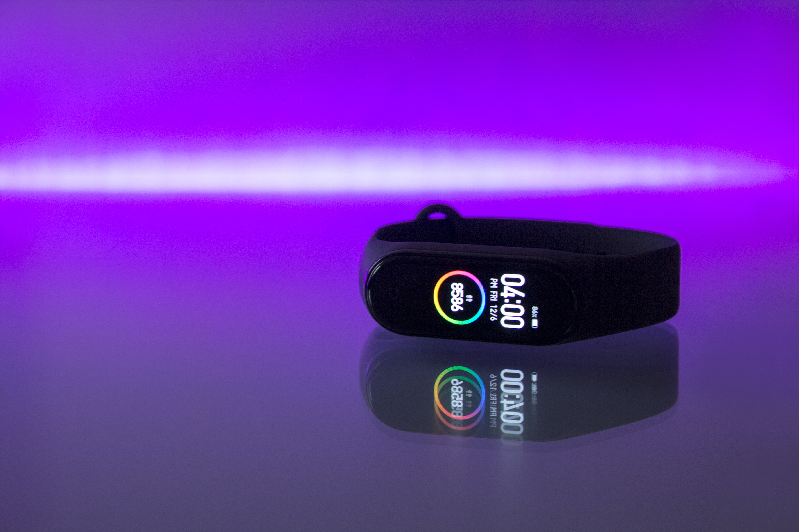

# Case-Study Data Analysis 

## Scenario

You are a junior data analyst working on the marketing analyst team at Bellabeat, a high-tech manufactures of health-focused products for women. Bellabeat is a sucessful small company, but they have the potenial to become a lager player in the global smart device market. Urška Sršen, cofounder and Chief Creative Officer of Bellabeat, believes that analyzing smart device fitness data could help unlock new growth opportunities for the company. You have been asked to focus on one of Bellabeat’s products and analyze smart device data to gain insight into how consumers are using their smart devices. Sršen asks you to analyze smart device usage data in order to gain insight into how consumers use non-Bellabeat smart devices. She then wants you to select one Bellabeat product to apply these insights to in your presentation. The insights you discover will then help guide marketing strategy for the company. You will present your analysis to the Bellabeat executive team along with your high-level recommendations for Bellabeat’s marketing strategy.

## Ask Phase

In this stage of the data analysis process, I identify key stakeholders and ask questions to guide the analysis process.

>### The Stakeholders

> 1. **Urška Sršen:** Bellabeat’s cofounder and Chief Creative Officer.
> 2. **Sando Mur:** Mathematician and Bellabeat’s cofounder; key member of the Bellabeat executive team.
> 3. **Bellabeat marketing analytics team:** A team of data analysts responsible for collecting, analyzing, and reporting data that helps guide Bellabeat’s marketing strategy.

>### Bellabeat Products

> 1. **Bellabeat app:** The Bellabeat app provides users with health data related to their activity, sleep, stress, menstrual cycle, and mindfulness habits. This data can help users better understand their current habits and make healthy decisions. The Bellabeat app connects to their line of smart wellness products.
> 2. **Leaf:** Bellabeat’s classic wellness tracker can be worn as a bracelet, necklace, or clip. The Leaf tracker connects to the Bellabeat app to track activity, sleep, and stress.
> 3. **Time:** This wellness watch combines the timeless look of a classic timepiece with smart technology to track user activity, sleep, and stress. The Time watch connects to the Bellabeat app to provide you with insights into your daily wellness.
> 4. **Spring:** This is a water bottle that tracks daily water intake using smart technology to ensure that you are appropriately hydrated throughout the day. The Spring bottle connects to the Bellabeat app to track your hydration levels.
> 5. **Bellabeat membership:** Bellabeat also offers a subscription-based membership program for users. Membership gives users 24/7 access to fully personalized guidance on nutrition, activity, sleep, health and beauty, and mindfulness based on their lifestyle and goals.

> ### Business Task

> The goal of this case study is to analyze smart device usage data to gain insight into how consumers use non-Bellabeat devices. The insights gained will be used to inform Bellabeat's marketing strategy.

## Prepare Phase

The goal of this case study is to analyze smart device usage data to gain insight into how consumers use non-Bellabeat devices. The insights gained will be used to inform Bellabeat's marketing strategy.

The data is made of up several datasets organized in either long or wide format. However, there are 2 key problems with the data. First, the data is not **recent** as it was collected in 2016. Second, the sample size is too small. Only data for **30** Fitbit users is available yet there are over **30 million** Fitbit users worldwide.

Given these limitations, additional data is required and insights gained from analyzing available data shall not be taken as conclusive.

## Load the packages

I will be using tidyverse package as well as the skimr, here, and janitor packages for help with this project.

We’re also using the sqldf package, which will allow us to emulate SQL syntax when looking at data

## install.packages("sqldf",repos = "http://cran.us.r-project.org")

package 'sqldf' successfully unpacked and MD5 sums checked

## library(sqldf)
Loading required package: gsubfn
Loading required package: proto
Loading required package: RSQLite

## library(tidyverse)
-- Attaching packages --------------------------------------- tidyverse 1.3.1 --
v ggplot2 3.3.5     v purrr   0.3.4
v tibble  3.1.6     v dplyr   1.0.7
v tidyr   1.1.4     v stringr 1.4.0
v readr   2.1.1     v forcats 0.5.1

-- Conflicts ------------------------------------------ tidyverse_conflicts() --
x dplyr::filter() masks stats::filter()
x dplyr::lag()    masks stats::lag()

## library(skimr)
## library(janitor)

Attaching package: 'janitor'
The following objects are masked from 'package:stats':
chisq.test, fisher.test

## Upload the dataset

he data that is provided is FitBit Fitness Tracker Data. This dataset has 18 different csv files that range from Daily activity, calories, steps; hourly calories, intensities, and steps; and heart rate, sleep data and weight logs.

## Load the CSV files

The data frames I’ll be working with in this case study will be creating objects for:

> 1. dailyActivity_merged.csv
> 2. dailyCalories_merged.csv
> 3. sleepDay_merged.csv
> 4. weightLogInfo_merged.csv
> 5. dailyItensities_merged.csv

## Explore the Tables
### dailyActivity

head(dailyActivity_merged)

|   Id       |  ActivityDate |  TotalSteps  |  TotalDistance | TrackerDistance |
| :---       | :---          | :---         | :---           | :---            |
| 1503960366 |  4/12/2016    |  13162       |   8.50         |   8.50          | 
| 1503960366 |  4/13/2016    |  10735       |   6.97         |   6.97          |
| 1503960366 |  4/14/2016    |  10460       |   6.74         |   6.74          |
| 1503960366 |  4/15/2016    |   9762       |   6.28         |   6.28          |
| 1503960366 |  4/16/2016    |  12669       |   8.16         |   8.16          |
| 1503960366 |  4/17/2016    |   9705       |   6.48         |   6.48          |
  
  
  

